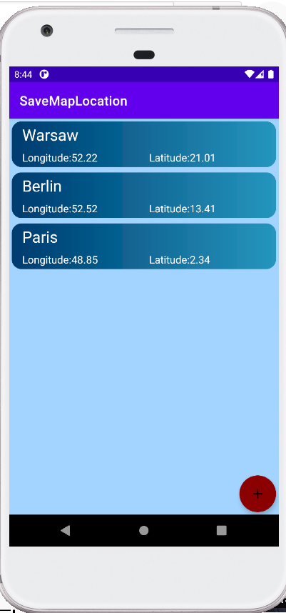

# SaveMapLocation
App allowing saving location selected from map.

Allows:
- browsing list of saved locations and displaying it on map,
- removing saved location with swipe,
- displaying location on google map.

Used technologies:
- recycler view,
- floating action button,
- remove list element on swipe left,
- updating list view,
- shared preferences,
- location service listeners,
- checking for and asking for permissions,
- Google Play services,
- finding views from layout with view binding.

List of saved locations          |  Saved location | Save location screen
:-------------------------:|:-------------------------:|:-------------------------:
  |  |  

<h3>Save new location</h3>
 

 
<h3>Open saved location</h3>
 

 
<h3>Remove saved location</h3>
 

